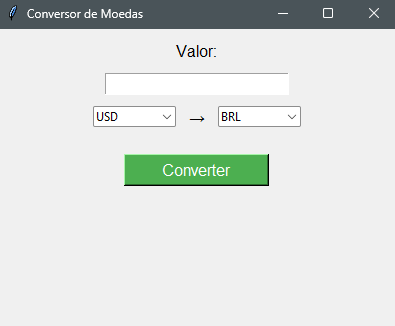

# 💱 Conversor de Moedas em Python

Um simples e funcional conversor de moedas com interface gráfica, feito em Python. Ele utiliza a API pública [exchangerate.host](https://exchangerate.host) para obter taxas de câmbio atualizadas em tempo real.

## 🖼 Interface



## 🚀 Como executar

1. Clone o repositório ou baixe os arquivos:
   ```bash
   git clone https://github.com/seu-usuario/conversor-moedas.git
   cd conversor-moedas
